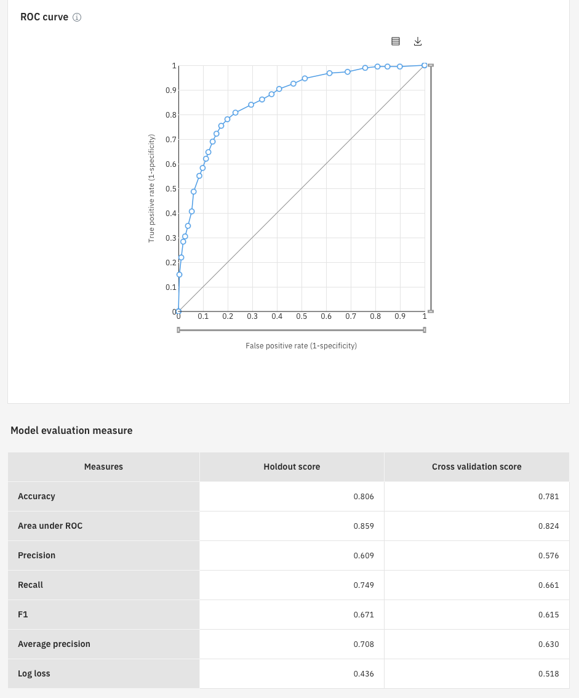

## Telco Customer Churn

#### `Context`

Predict behavior to retain customers. You can analyze all relevant customer data and develop focused customer retention programs. 

#### `Content`

Each row represents a customer, each column contains customer’s attributes described on the column Meta-data.

The data set includes information about:

- Customers who left within the last month – the column is called `Churn`
- Services that each customer has signed up for – phone, multiple lines, internet, online security, online backup, device protection, tech support, and streaming TV and movies
- Customer account information – how long they’ve been a customer, contract, payment method, paperless billing, monthly charges, and total charges
- Demographic info about customers – gender, age range, and if they have partners and dependents

#### `Inspiration`

To explore this type of models and learn more about the subject.


### `Downloading our dataset`


### `IBM Watson Studios`


### `Create a new project`


### `Creating a new asset AutoAI`


### `Creating a new asset AutoAI II`


### `Predicting on Churn with Binary Classification`


As you can see as soon as we uploaded our dataset and selected what column 
we wanted to predict on, the experiment automatically gave us the best
prediction type to use on the data, in this case `Binary Classification`
and is optimized for accuracy and runtime

### `Progress Map of various Pipelines`


Here we can see various amounts of pipelines, each one using a different algorithm,
at the bottom we see a comparison of the pipelines and we can see that they choose the most optimal one for our task

### `Pipeline Comparison`


Here we can see that Pipeline 4 has been chosen to be the best measured on accuracy,
lets take a look inside the pipeline

### `Pipeline Analysis I`


Here we see the basic information of our Pipeline including
the algorithm is used: Random Forest Classifier, the number
of features: 34, and number of evaluation instances: 705.


### `Pipeline Analysis II`


Here we see the Feature Summary, each feature with its respective feature importance percentage.

### `Evaluation Metrics`


Here we can see the Evaluation Metrics such as `ROC Curve`, 
`Cross Validation Score`, `Precision`, `F1 Score`, etc...

### `Confusion Matrix`


Here we see the Confusion Matrix

### `Precision Recall`


### `Saving our Model for Deployment`


### `Deployment of Model`


### `Deployment of Model`


```python

import requests

# NOTE: you must manually set API_KEY below using information retrieved from your IBM Cloud account.
API_KEY = "<your API key>"
token_response = requests.post('https://iam.cloud.ibm.com/identity/token', data={"apikey":
 API_KEY, "grant_type": 'urn:ibm:params:oauth:grant-type:apikey'})
mltoken = token_response.json()["access_token"]

header = {'Content-Type': 'application/json', 'Authorization': 'Bearer ' + mltoken}
```
```python
# NOTE: manually define and pass the array(s) of values to be scored in the next line
payload_scoring = {"input_data": [{"fields": [array_of_input_fields], "values": [array_of_values_to_be_scored, another_array_of_values_to_be_scored]}]}

response_scoring = requests.post('https://us-south.ml.cloud.ibm.com/ml/v4/deployments/41ccb00d-42ea-4b4a-ab21-5721eaeb9eb3/predictions?version=2023-02-28', json=payload_scoring,
 headers={'Authorization': 'Bearer ' + mltoken})
print("Scoring response")

```


